# Udacity Data Science Nanodegree
## Capstone Project: Create a Customer Segmentation Report for Arvato Financial Solutions

### Table of Contents

1. [Steps to Complete This Project](#steps)
2. [Pre-Installation](#install)
3. [File Description](#file)
4. [Summary](#summary)

### Steps to Complete This Project 
The project has three major steps: the customer segmentation report, the supervised learning model, and the Kaggle Competition.

1. Customer Segmentation Report
This section will be familiar to the corresponding project in Term 1 of the program, but the datasets now include more features that you can potentially use. You'll begin the project by using unsupervised learning methods to analyze attributes of established customers and the general population in order to create customer segments.

2. Supervised Learning Model
You'll have access to a third dataset with attributes from targets of a mail order campaign. You'll use the previous analysis to build a machine learning model that predicts whether or not each individual will respond to the campaign.

3. Kaggle Competition
Once you've chosen a model, you'll use it to make predictions on the campaign data as part of a Kaggle Competition. You'll rank the individuals by how likely they are to convert to being a customer, and see how your modeling skills measure up against your fellow students.

### Pre-Installation 

This project requires **Python 3.x** and the following Python libraries installed:

- [Jupyter Notebook](https://jupyter.org/)
- [NumPy](http://www.numpy.org/)
- [SciPy](https://www.scipy.org/)
- [Pandas](http://pandas.pydata.org)
- [matplotlib](http://matplotlib.org/)
- [seaborn](https://seaborn.pydata.org/)
- [scikit-learn](http://scikit-learn.org/stable/)
- [xgboost](https://xgboost.readthedocs.io/)
- [lgbm](https://lightgbm.readthedocs.io/)

### File Description 

- Arvato Project Workbook.ipynb (Jupyter Notebook): main work with detailed descriptive steps of analysis
- helper.py (python script): some helper functions used in the notebook
- savefile (folder): saved models from each part of analysis in the notebook
- arvato_data (folder): all csv files used in this notebook, including raw data, data dictionary, and processed data generated from the notebook

To run Arvato Project Workbook.ipynb, you also need to copy the following files under the directory of "arvato_data":
- Udacity_AZDIAS_052018.csv (1.09 GB) Demographic data for the general population of Germany; 891 211 persons (rows) x 366 features (columns)
- Udacity_CUSTOMERS_052018.csv (218.5 MB) Demographic data for customers of a mail-order company; 191652 persons (rows) x 369 features (columns).

### Summary 
To read the full story, follow the blog post [Here](https://medium.com/@zhitaowang/investigating-customer-segments-and-predicting-response-rate-in-marketing-campaign-f024eb268b87).

In this report, I have attempted to solve real-life data science problems posed by Arvato Financial Solutions. Below is a summary of my major achievement:

In the first step, I have conducted exploratory analysis to gain better understanding about the datasets. Via accessing the missing values, I have found that individuals with a large portion of missing feature attributes are different from the majority. This cluster has been treated as a special group in throughout the analysis. Other feature re-encoding steps have been performed, including converting categorical features to dummy variables, and decomposing “mixed” features to “atomic” types.

To investigate customer segmentation, I applied PCA transformation to gain a better understanding about the relationship of correlated features. Using k-means, I have segmented the general population and customers into 11 clusters. By comparing their distribution, I found the core customer base of the company. Some typical personal attributes of such clusters include a high income and a mature age.

Finally, I have applied several popular machine learning algorithms to predict the probability of response rate of customers during a mail-out campaign. Using the LGBM model, I have achieved an AUC score of 0.79981 on Kaggle. I have also found a poor prediction in particular on the segment of individuals lacking too many informative features.

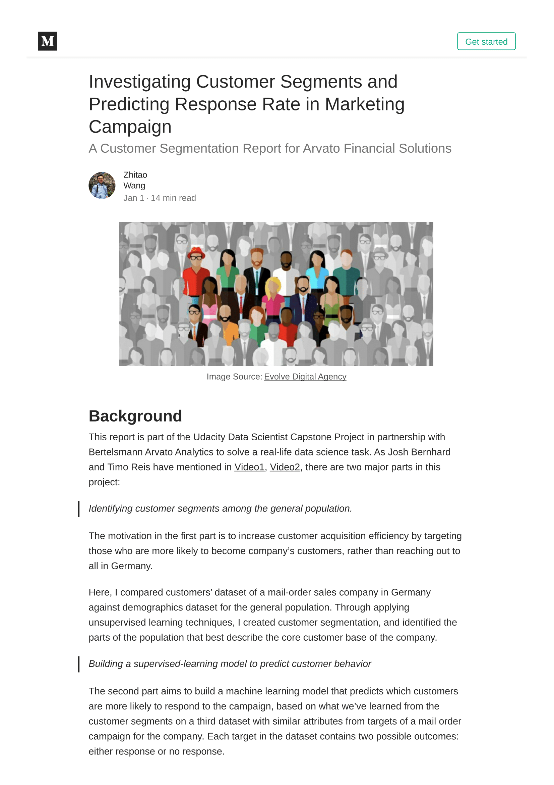
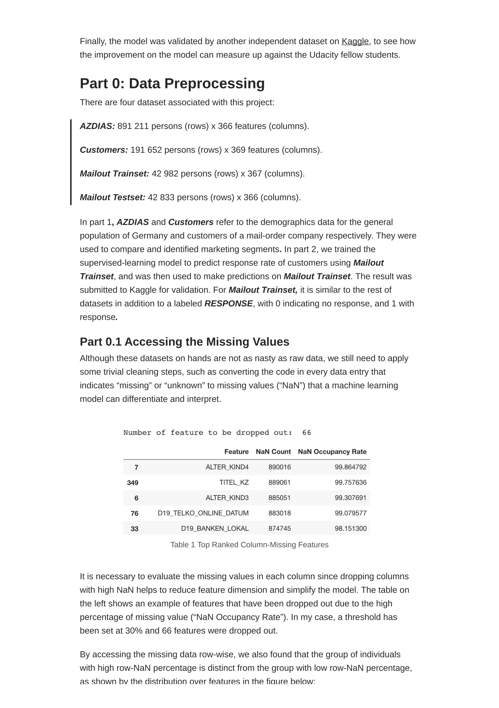
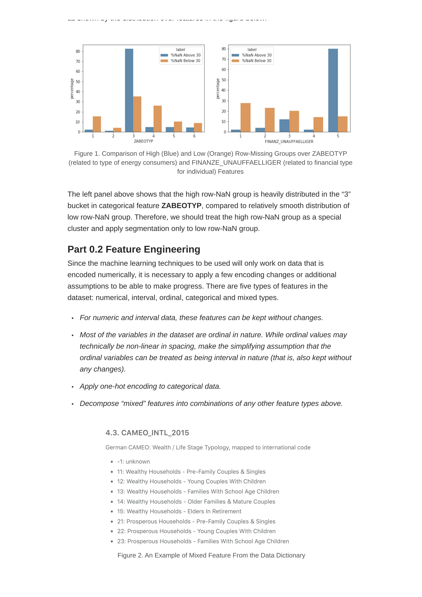
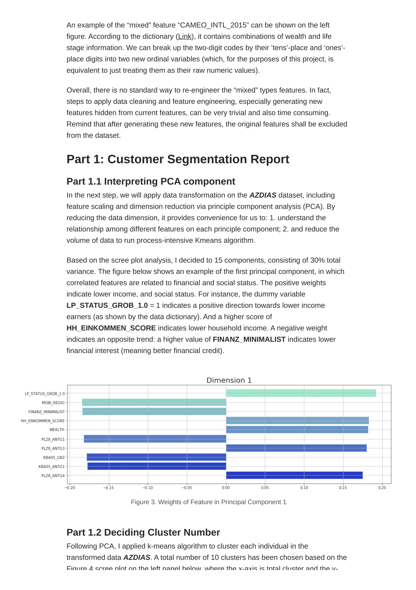
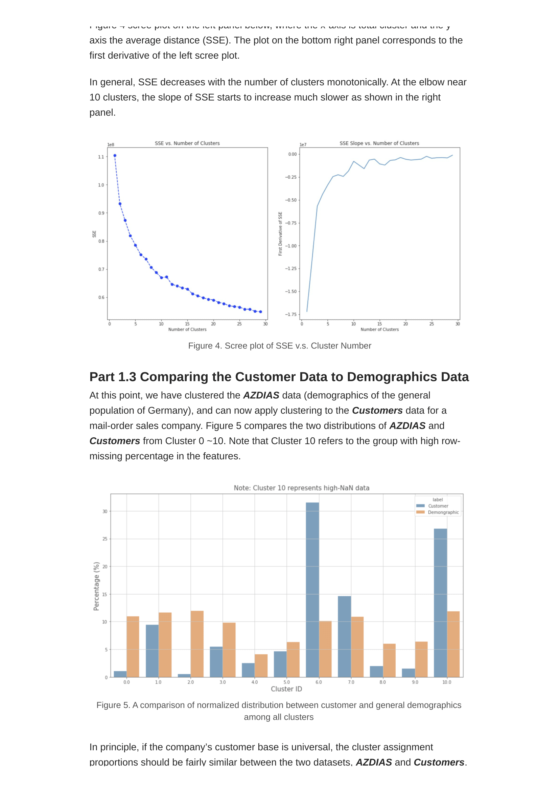
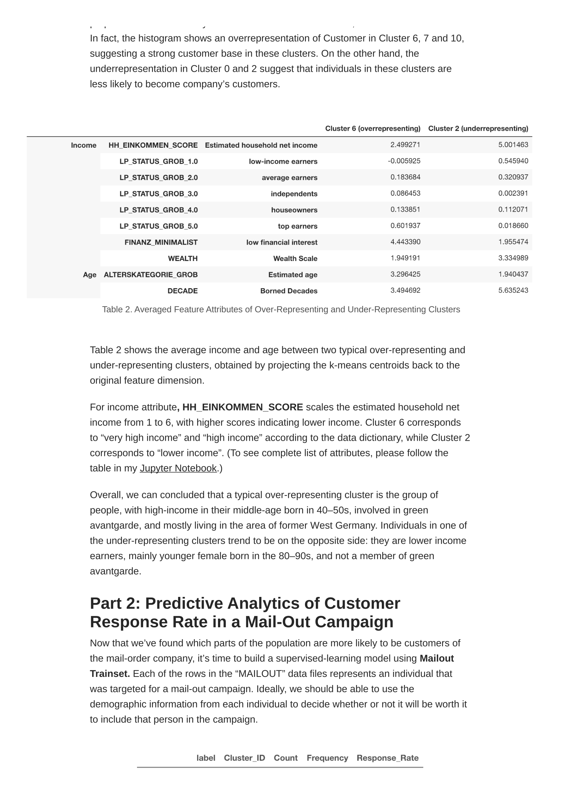
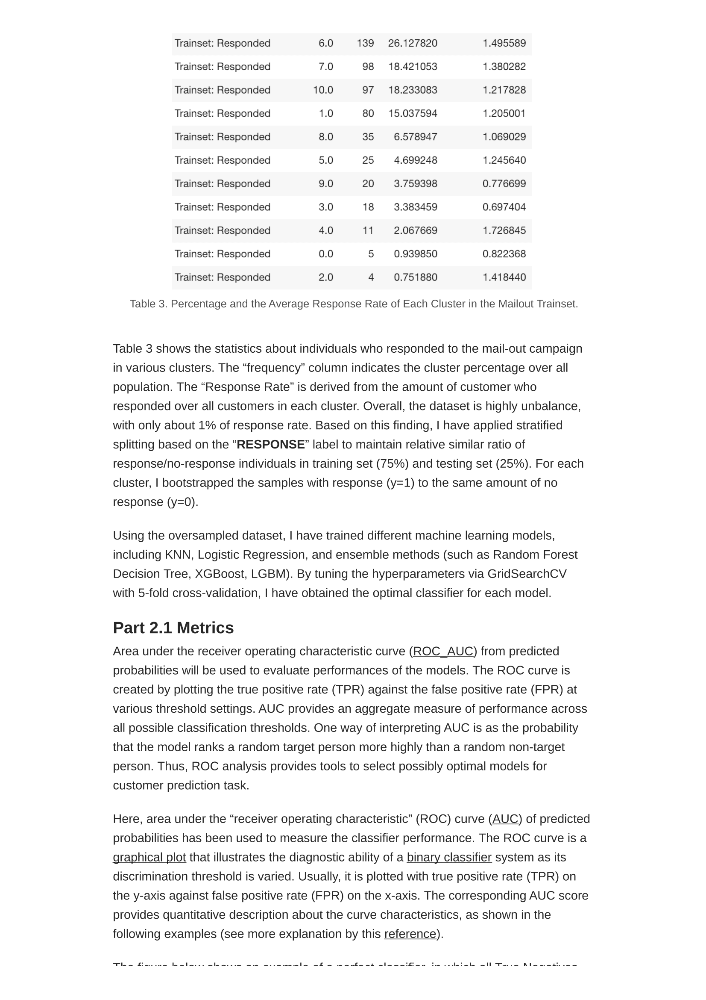
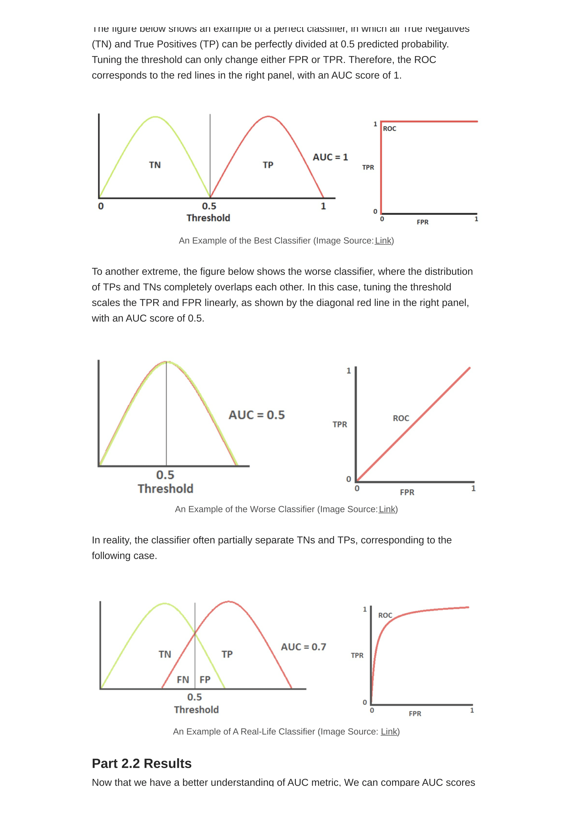
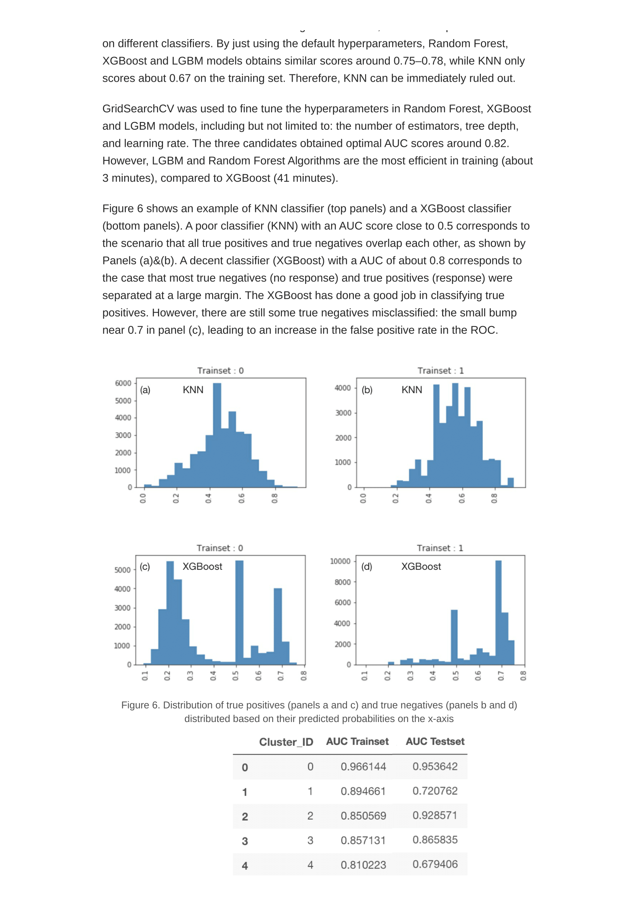
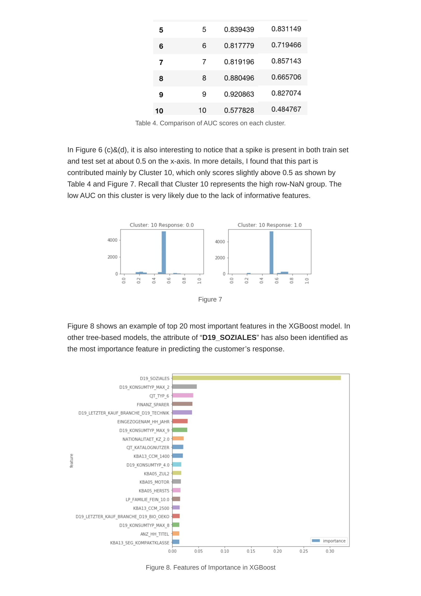
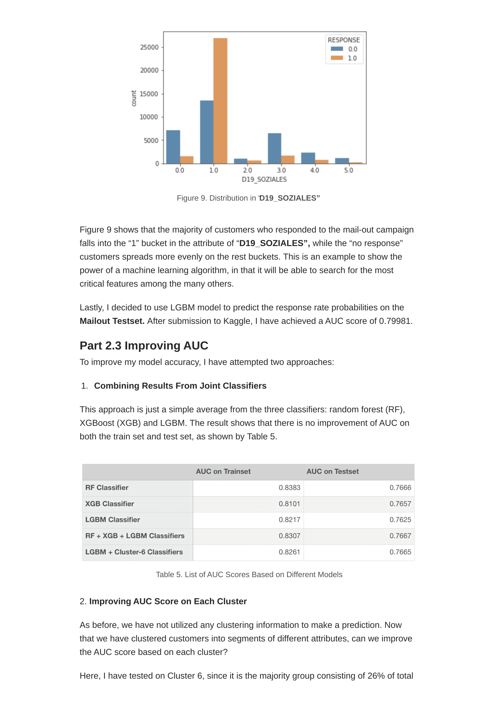
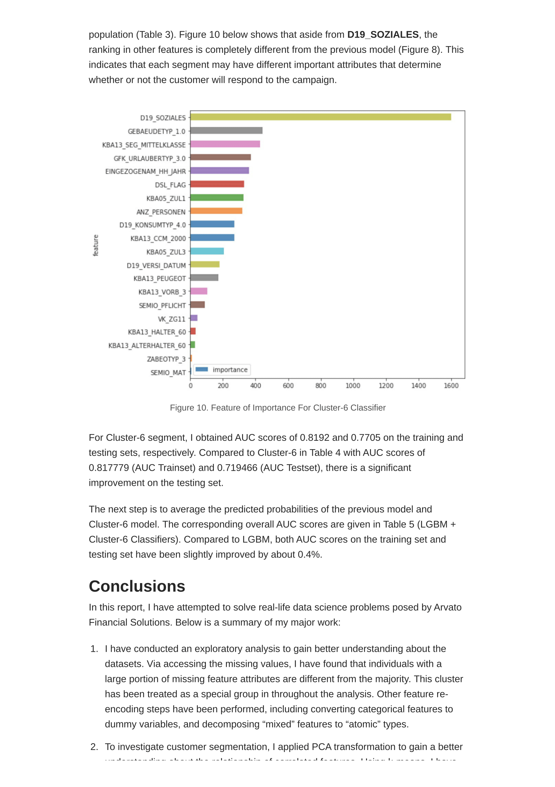
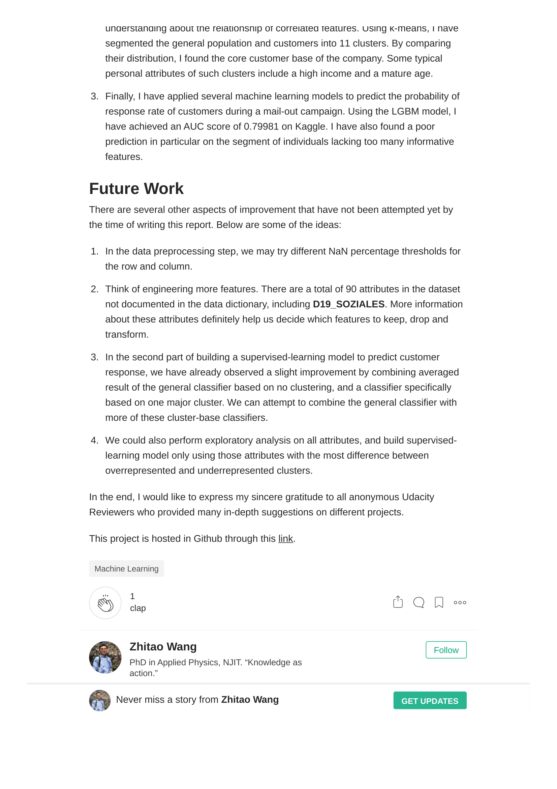

